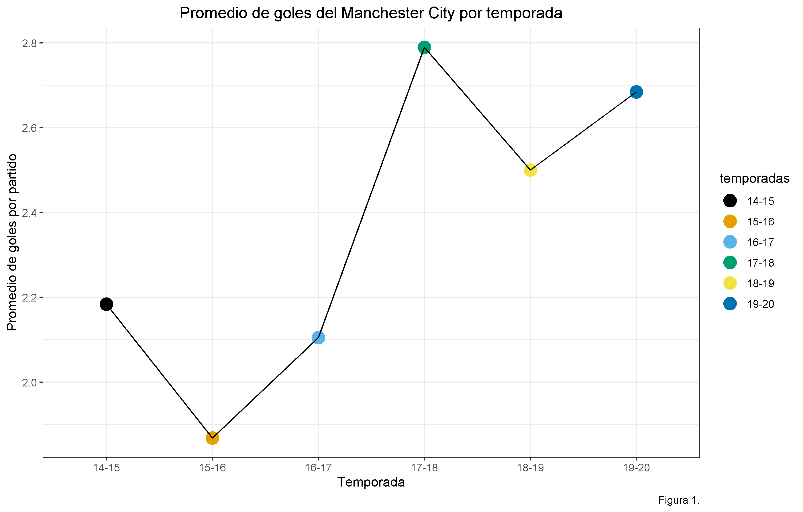
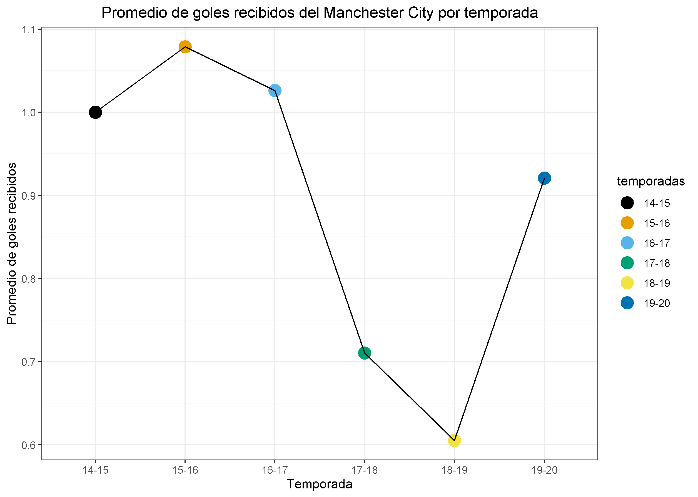
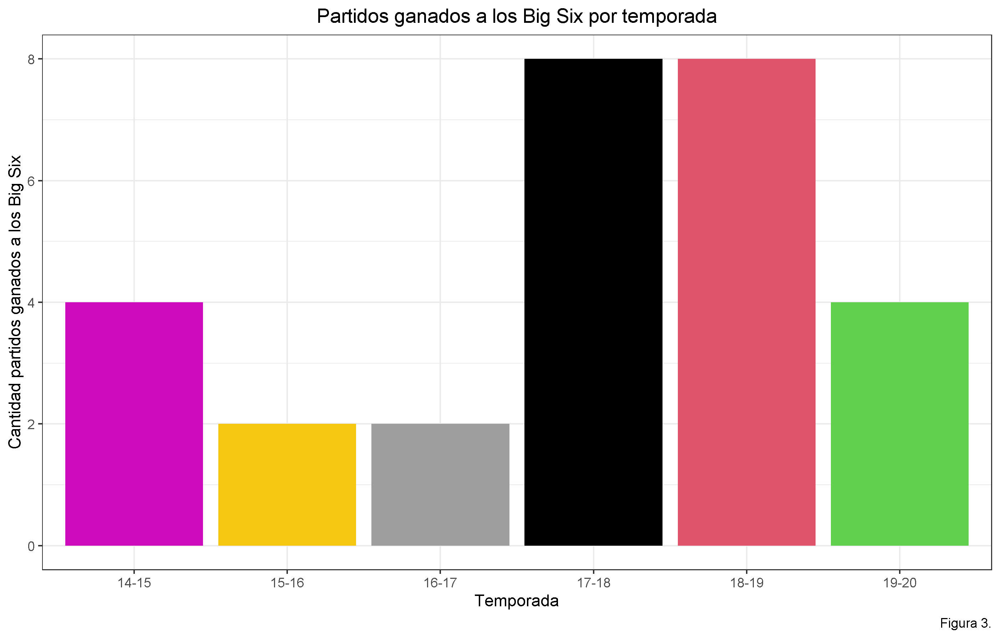
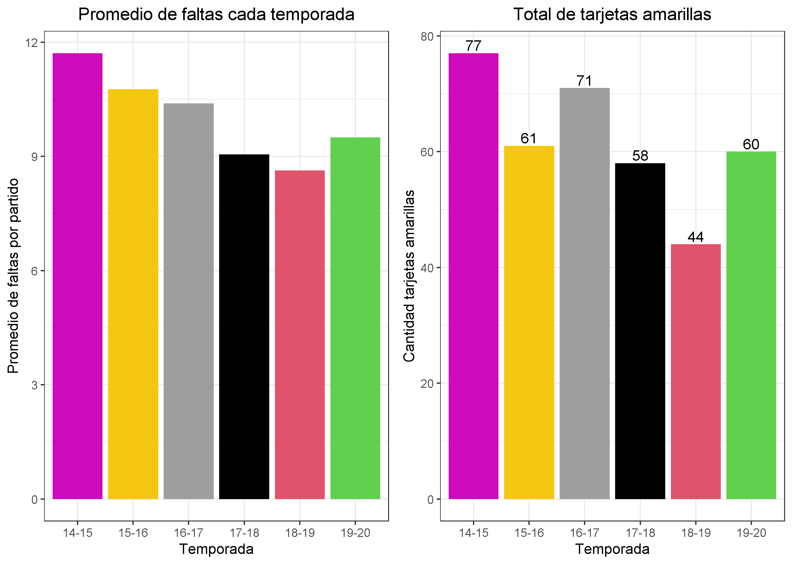

```{r setup, include=FALSE}
knitr::opts_chunk$set(echo = TRUE)
```

<h2> Introducción </h2>

<p> Actualmente la premier league de inglaterra es de las ligas de fútbol más competitivas del mundo (https://bleacherreport.com/articles/1458287-ranking-the-top-20-world-football-leagues-statistically) , pues desde hace varios años que los equipos que salen campeones varian cada temporada, y siempre hay algún equipo que da la sorpresa. El Manchester City, equipo que juega en la premier league actualmente, ha destacado los últimos años, ganando varios títulos y mostrando una gran mejoría con respecto a años anteriores, donde no solía destacar. A lo largo de este informe, se analizará el desempeño del equipo Manchester City entre las temporadas 2014-2015 y 2019-2020, para luego ver si hay algo que el equipo deba hacer mejor a futuro para aspirar a salir campeón. </p>

<br>

<p> En este análisis se tratará de encontrar las debilidades del equipo para poder cubrirlas y luego poder mejorarlas a futuro. Esas debilidades pueden influir mucho al desempeño del equipo, por lo que entenderlas y mejorarlas es muy importante para que el Manchester City pueda llegar a ser campeón a futuro.</p>

<br>

<p> Es por esto que en este informe se revisarán los factores que más influyeron en el desempeño del equipo, y se enfocará en determinar a grandes rasgos las falencias que el equipo ha tenido en estos últimos años, para poder mejorarlas. </p>

<br>

<p> El informe se desarrollará en cuatro secciones: primero se hará una pequeña introducción para que el lector entre en contexto con el tema y con alguna información que no se analizó pues no se encuentra en la base de datos, después se analizarán los goles marcados y recibidos por el equipo en cada temporada a través de gráficos, luego se hará una comparación de los resultados obtenidos por el equipo contra los __big six__ ([Qué son los big six?](https://www.bettingsites.co/sports/football/premier-league/big-six/#)) en cada temporada, y ver si esto influyó en que el equipo haya salido campeón, por último se sacarán conclusiones de estos resultados, para ver cuales son las debilidades que debe cubrir el equipo. 
Cabe recalcar que en este análisis no se usa toda la información que influye en los resultados de cada partido pues esta información va más allá de lo que se puede analizar en esta base de datos. Por lo que si se quisiera obtener conclusiones más precisas se podría hacer un análisis que abarque más años y que además use otras variables que no están en esta base de datos, como por ejemplo los jugadores que tiene el equipo, las lesiones, etc. </p>

<hr>

<h2> Contexto </h2>

<p> La premier league es una liga de fútbol europea, la cual gana el equipo que logre más puntos a lo largo de la temporada. Cada temporada tiene 38 partidos.  
La siguiente tabla muestra las posiciones en las que ha terminado el Manchester City en cada temporada, los respectivos puntos que obtuvo y el técnico que lo dirigía: 

| Temporada | Posición | Puntos | Técnico |
| --------- | -------- | ------ | ----------------- |
| 2014-2015 |    2°    |   79   | Manuel Pellegrini |
| 2015-2016 |    4°    |   66   | Manuel Pellegrini |
| 2016-2017 |    3°    |   78   | Pep Guardiola |
| **2017-2018** |    **1°**    |   **100**  | **Pep Guardiola** |
| **2018-2019** |    **1°**    |   **98**   | **Pep Guardiola** |
| 2019-2020 |    2°    |   81   | Pep Guardiola |

Como podemos ver, ultimamente le ha ido bien al equipo, pero de los seis años que se hizo el análisis solo ganó la liga dos veces, por lo que ahora analizaremos que fue lo que más afectó en esos cuatro años que no se ganó la liga.  
Ahora que sabemos esto podemos comenzar con nuestro análisis.

<hr> 

<h2> Resultados </h2>

<br>

<h3> Promedio de Goles marcados </h3>

<p> Lo primero que vamos a ver en nuestro análisis va a ser el promedio de goles marcados por el equipo a lo largo de las temporadas.  
Veamos esto graficamente

```{r, echo=FALSE}

```

Como podemos notar en el gráfico, la temporada con más goles es la temporada 17-18, en la cual el equipo ganó la liga. Pero también podemos notar que la temporada 18-19 el promedio de goles es menor y aún asi ganaron la liga.  

<br>

<h3> Promedio de Goles recibidos </h3>

Ahora veremos un gráfico del promedio de goles recibidos por temporada.

```{r, echo = FALSE}

```

Como podemos ver, las dos temporadas en que el equipo salío campeón, son las temporadas en las que menos goles recibió, por lo que quizá podemos pensar que no recibir goles es una variable importante para ganar los partidos.  

Los gráficos anteriores nos dan una idea del desempeño que tuvo el equipo en las respectivas temporadas.  
Ahora veremos una tabla que nos indica la diferencia de gol que tuvo el equipo cada temporada. Donde la diferencia de gol se refiere a la cantidad de goles anotados menos la cantidad de goles recibidos en una temporada.

| Temporada | Diferencia de Gol |
| --------- | ----------------- |
| 2014-2015 |       45          |
| 2015-2016 |       30          |
| 2016-2017 |       41          |
| **2017-2018** |       **79**          |
| **2018-2019** |       **72**          |
| 2019-2020 |       67          |

Las temporadas que el equipo tuvo un mejor desempeño fueron las que mayor diferencia de gol tuvo, por lo que este es un factor importante para ver el desempeño del equipo.

<br>

<h3> Resultados contra big six </h3>

Ahora veremos el desempeño que tuvo el equipo contra los que son considerados los mejores cinco equipos de la Premier League, estos equipos son: Liverpool, Arsenal, Chelsea, Manchester United y Tottenham.  
Se juega dos partidos contra cada equipo, por lo que en total son diez partidos.  

```{r, echo = FALSE}

```

Como podemos notar en el gráfico las temporadas en que el equipo tuvo más victorias contra los big six fueron las temporadas en que salió campeón.  
En estas temporadas tuvo más que el doble de victorias contra estos equipos, por lo que es bastante lógico pensar que ganarle a estos equipos es un factor importante para que ganar la liga.  

<h3> Promedio Faltas y Cantidad amarillas </h3>

Por último veremos el promedio de faltas que cometió el equipo por partido, y la cantidad total de amarillas recibidas por el equipo cada temporada.  
Contrastamos estos dos resultados juntos pues están directamente relacionados, lo que se puede notar en los siguientes gráficos

```{r, echo = FALSE}

```

Como podemos ver en los gráficos, las temporadas en las que menos faltas cometió el equipo y en las que menos tarjetas amarillas recibió, fueron en las que ganó la liga, por lo que vemos la importancia de tratar de cometer la menor cantidad de infracciones y tratar de evitar las tarjetas, pues hacer lo anterior influye notablemente en el resultado de un partido.

<hr>

<h2> Conclusión </h2>

Con los resultados vistos anteriormente podemos concluir que ...... _agregar conclusión_


