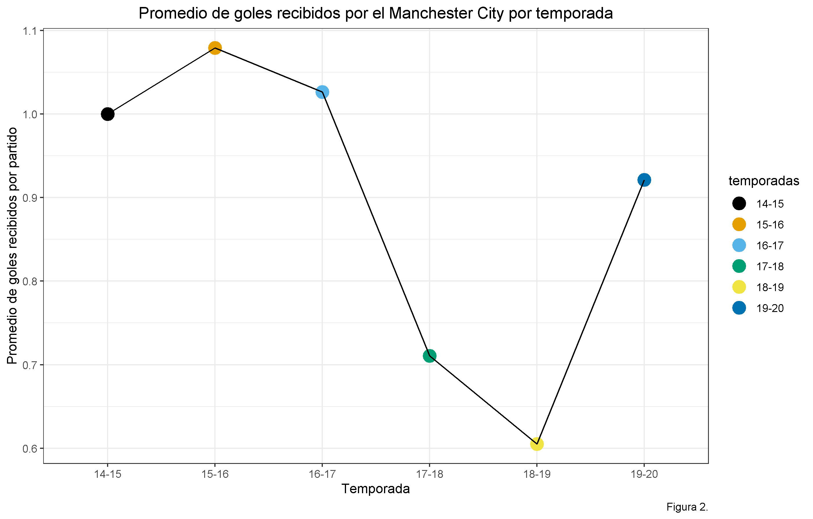
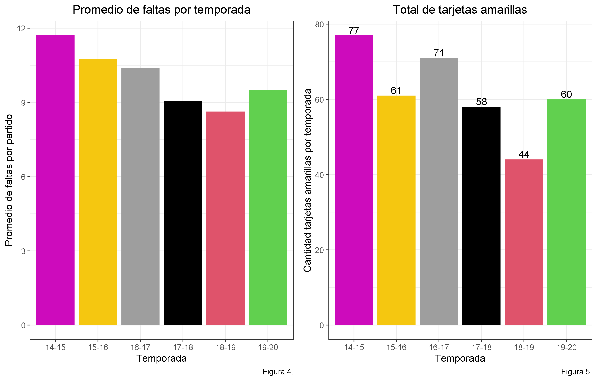

```{r setup, include=FALSE}
knitr::opts_chunk$set(echo = TRUE)
```
<h2> Resumen </h2>

<p> Se analizó el desempeño del Manchester City en la Premier League a lo largo de varias temporadas con el objetivo de notar cuales son las variables que más influyen en los resultados obtenidos en estas.  Las variables que parecen tener mayor impacto en las posiciones del equipo en la tabla cada temporada son: recibir la menor cantidad de goles posible, tener una gran diferencia de goles, ganarles a los equipos que componen el big six y cometer pocas infracciones para evitar recibir tarjetas amarillas. Concluimos que si el equipo trabaja en lo anterior, puede llegar a obtener mejores resultados. </p>

<hr>

<h2> Introducción </h2>

<p> Actualmente la Premier League de Inglaterra es de las ligas de fútbol más competitivas del mundo [^nota1]. Desde hace varios años que los equipos que salen campeones varian cada temporada y en muchas ocasiones hay alguno que da la sorpresa. El Manchester City, uno de los equipos que juegan en esta liga, ha destacado los últimos años, ganando varios títulos y mostrando una gran mejoría con respecto a temporadas anteriores. </p> 

<p> Al igual que muchos otros deportes, el fútbol genera una enorme cantidad de datos y analizar estos datos, nos puede dar una idea de cuales pueden ser los factores que más influyen en el desempeño de un equipo en cada temporada. </p>

[^nota1]: Bleacher Report. (01/03/2013). Recuperado de https://bleacherreport.com/articles/1458287-ranking-the-top-20-world-football-leagues-statistically

<br>

<p> En relación al punto anterior, en este informe intentaremos determinar cuáles son las variables que parecen influir más en el desempeño que tuvo el equipo entre las temporadas 2014-2015 y 2019-2020, para luego, con esa información, ver si hay algo que el equipo deba hacer mejor a futuro para aspirar a salir campeón. </p>

<br>

<p> El informe se desarrollará en cuatro secciones: primero se hará una pequeña introducción para que el lector tenga contexto del tema. Después se analizarán los goles marcados y recibidos por el equipo en cada temporada a través de gráficos.  
A continuación, se hará una comparación de los resultados obtenidos por el equipo contra los equipos más destacados de la liga (conocidos como los __big six__  [^nota2]) en cada temporada, para determinar si esto influyó en que este equipo haya salido campeón.   Finalmente, se obtendrán conclusiones de estos resultados, para analizar cuales son las debilidades que debería trabajar el equipo.  
Cabe recalcar que en este análisis no se usó toda la información que influye en los resultados de cada partido, pues esta es insuficiente, por las pocas variables contenidas en esta base de datos. En este contexto, si se quisiera obtener conclusiones más precisas se podría hacer un análisis que abarque más años y que además use otras variables que no están en esta base, como por ejemplo los jugadores que tiene el equipo, la información sobre las lesiones, etc. </p>

[^nota2]: Betting Sites. (2020). Recuperado de https://www.bettingsites.co/sports/football/premier-league/big-six/#

<hr>

<h2> Contexto </h2>

<p> La Premier League es una liga de fútbol europeo, en la que (al igual que en la mayoría de las ligas) gana el equipo que logre obtener más puntos a lo largo de la temporada. En este caso en particular, la temporada consta 38 partidos.  
La siguiente tabla muestra las posiciones en las que ha terminado el Manchester City en cada una de las temporadas comprendidas en esta base de datos, los puntos que obtuvo y el técnico que lo dirigía: 

<center> _Tabla 1. Datos externos a la base_ </center>
| Temporada | Posición | Puntos | Técnico |
| --------- | -------- | ------ | ----------------- |
| 2014-2015 |    2°    |   79   | Manuel Pellegrini |
| 2015-2016 |    4°    |   66   | Manuel Pellegrini |
| 2016-2017 |    3°    |   78   | Pep Guardiola |
| **2017-2018** |    **1°**    |   **100**  | **Pep Guardiola** |
| **2018-2019** |    **1°**    |   **98**   | **Pep Guardiola** |
| 2019-2020 |    2°    |   81   | Pep Guardiola |

Notamos en la tabla que últimamente el equipo ha tenido un muy buen desempeño, sin embargo, de los seis años que considera el análisis solo ganó la liga dos veces. Es por esto que interesa analizar qué factores fueron los que más afectaron en los cuatro años que no ganó la liga.  

<hr>

<h2> Información sobre la base de datos utilizada </h2>

<p> Para este informe se usaron seis bases de datos (una por cada temporada analizada), las cuales fueron descargadas de la página Football-Data [^nota3].  
Estas tienen la información de cada partido jugado en la temporada, por lo que en total tiene 380 observaciones.
Para motivos del análisis se quitaron todas las variables que servían en el ámbito de las apuestas, pues no forman parte de los objetivos de este informe.  
La siguiente tabla muestra las variables usadas: </p>

<center> _Tabla 2. Variables de la base de datos_ </center>
| variable | tipo de varible | descripción |
|---|---|---|
| HomeTeam | Caracter | Nombre del equipo local |
| AwayTeam | Caracter | Nombre del equipó visitante |
| FTHG | Numérica | Goles hechos por el equipo local al término del partido |
| FTAG | Numérica  | Goles hechos por el equipo visitante al término del partido  |
| FTR | Caracter | Resultado del partido: H = Gana local, D = Empate, A = Gana Visita |
| HTHG | Numérica | Goles hechos por el equipo local al término del primer tiempo |
| HTAG | Numérica | Goles hechos por el equipo visitante al término del primer tiempo |
| HTR | Caracter | Resultado del partido hasta el medio tiempo: H = Gana local, D = Empate, A = Gana Visita |
| HF | Numérica | Faltas cometidas por el equipo local |
| AF | Numérica  | Faltas cometidas por el equipo visitante |
| HY | Numérica  | Tarjetas amarillas recibidas por el equipo local |
| AY | Numérica  | Tarjetas amarillas recibidas por el equipo visitante |
| HR | Numérica  | Tarjetas rojas recibidas por el equipo local |
| AR | Numérica  | Tarjetas rojas recibidas por el equipo visitante |

<p> Según se observa en la tabla anterior, estas variables no son los únicos factores a revisar en un partido, pero sí nos pueden ayudar a hacer un análisis (aunque quizás no tan acertado). </p>

[^nota3]: Football-Data. (2014-2019). Recuperado de https://www.football-data.co.uk/englandm.php

<hr>

<h2> Resultados </h2>

<br>

<h3> Promedio de goles marcados por partido</h3>

<p> El primer punto que analizaremos será el promedio de goles marcados por el equipo a lo largo de las temporadas.  
Veamos esto gráficamente

```{r, echo=FALSE}
knitr::include_graphics("../figuras/promedio-goles-city.png")
```

El gráfico anterior muestra que la temporada con más goles es la de  17-18, en la que el equipo ganó la liga. También es posible notar que en la temporada 18-19 el promedio de goles fue menor y aún así ganaron la liga.  

<br>

<h3> Promedio de goles recibidos por partido </h3>

Lo siguiente a analizar es un gráfico del promedio de goles recibidos por partido cada temporada.

```{r, echo = FALSE}

```

Observamos que las dos temporadas en que el equipo salió campeón, son en las que menos goles recibió, por lo que podemos pensar que no recibir goles es una variable importante para ganar la liga.

Los gráficos anteriores nos dan una idea del desempeño que tuvo el equipo en las respectivas temporadas.  A continuación, se muestra una tabla que nos indica la diferencia de goles que tuvo el equipo cada temporada. La diferencia de gol se refiere a la cantidad de goles anotados menos la cantidad de goles recibidos en una temporada.

<center> _Tabla 3. Diferencia de goles por temporada_ </center>
| Temporada | Diferencia de Goles |
| --------- | ----------------- |
| 2014-2015 |       45          |
| 2015-2016 |       30          |
| 2016-2017 |       41          |
| **2017-2018** |       **79**          |
| **2018-2019** |       **72**          |
| 2019-2020 |       67          |

Las temporadas que el equipo tuvo un mejor resultado fueron las que mayor diferencia de gol tuvo, por lo que podemos pensar que este es un factor importante a la hora de analizar.

<br>

<h3> Resultados contra big six </h3>

Lo siguiente será ver el desempeño que tuvo el equipo contra los equipos que son considerados como los cinco mejores de la Premier League: Liverpool, Arsenal, Chelsea, Manchester United y Tottenham.  
A lo largo de la temporada se juegan dos partidos contra cada equipo de estos, por lo que en total son diez los partidos que se juegan contra estos cinco equipos.  

```{r, echo = FALSE}
knitr::include_graphics("../figuras/ganados-a-big-six.png")
```

Como podemos ver en el gráfico, las temporadas en que el equipo tuvo más victorias contra los big six fueron aquéllas en que salió campeón. En ellas tuvo más de el doble de victorias, por lo que es bastante lógico pensar que ganarle a estos equipos es un factor importante para obtener el título.  

<h3> Promedio faltas y cantidad de tarjetas amarillas </h3>

Por último, veremos el promedio de faltas que cometió el equipo por partido en cada temporada y por otra parte, la cantidad total de tarjetas amarillas recibidas por el equipo en cada temporada. Contrastamos estos dos resultados juntos pues están directamente relacionados, lo que se puede notar en los siguientes gráficos

```{r, echo = FALSE}

```

Tal como se observa en los gráficos, las temporadas en las que menos faltas cometió el equipo y en las que menos tarjetas amarillas recibió, fueron en las que ganó la liga. Lo anterior permite pensar que cometer la menor cantidad de infracciones y evitar las tarjetas, influye en el resultado de una temporada.

<hr>

<h2> Conclusión </h2>

Al analizar los resultados obtenidos en este informe, podemos concluir: 

<h3> Factores que se relacionan con el desempeño del equipo: </h3>

* Marcar una gran cantidad de goles por partido parece un factor importante para ganar la liga, pero no recibir goles es aún más importante, ya que el segundo año que el equipo marcó mayor cantidad de goles no ganó la liga, mientras que en los dos años que salió campeón recibió una mucho menor cantidad de goles en promedio. De igual manera, tener una diferencia de goles alta también se puede asociar con un mejor desempeño.

* La cantidad de faltas cometidas y el número de tarjetas amarillas recibidas parecen tener relación con la posición final del equipo en la tabla, verificándose que a mayor número de estas, se observó un peor rendimiento.

* El ganarle a los equipos que forman parte de los big six, estaría directamente relacionado con la posibilidad de ganar el campeonato, ya que las dos temporadas en que el Manchester City ganó la mayor cantidad de partidos a los big six (con amplia diferencia), fueron aquellas en que resultó campeón.

<h3> Recomendaciones al equipo: </h3> 

Considerando los datos analizados, si el Manchester City quisiera mejorar sus resultados en la Premier League, debería enfocarse en: evitar recibir goles, aumentar la diferencia entre goles marcados-goles recibidos, ganarle a los equipos que componen la big six y evitar cometer faltas y por tanto, recibir tarjetas amarillas.

<h3> Limitaciones: </h3>

Si contáramos con mayor cantidad de variables en nuestra base de datos, tales como: presupuesto del equipo, lista de jugadores lesionados por partido, nómina de jugadores por partido, entre otros, podríamos hacer un análisis más completo.

<hr> 

<h2> Referencias </h2>


